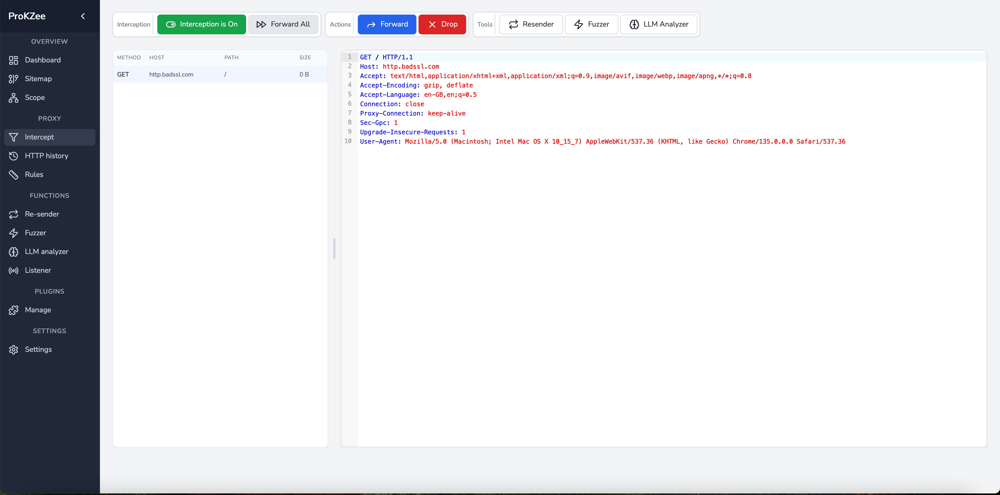

<div align="center">

<a href="https://github.com/al-sultani/prokzee"></a>

[](https://wails.io)
[](https://reactjs.org)
[](LICENSE)
[](https://golang.org)
[](https://github.com/al-sultani/prokzee/)
[](https://github.com/al-sultani/prokzee/issues)
[](https://github.com/al-sultani/prokzee/stargazers)


A powerful and modern cross-platform desktop application for HTTP/HTTPS traffic interception and analysis, built with Go and React. 

[Features](#features) • [Installation](#installation) • [Usage](#usage) • [Development](#development) • [Contributing](#contributing) • [Docker Support](#docker-support) • [Issues](#issues) • [Roadmap](#roadmap) • [License](#license) • [Author](#author)
<!-- Change to GIF -->


</div>

## <a id="features"></a> ✨ Features

- 🔐 Intercept and analyze HTTP/HTTPS traffic
- 🚀 Built with Go and React for maximum performance
- 💻 Modern and intuitive user interface
- 🛠 Powerful traffic manipulation tools
- 🌓 Dark and light theme support
- 🔄 Request resender for quick retesting
- 🧪 Fuzzer for security testing and vulnerability discovery
- 🪝 Interactsh integration for out-of-band testing
- 🤖 AI-powered analysis with ChatGPT integration
- 📱 Cross-platform support (Windows, macOS, Linux)

## <a id="installation"></a> 🚀 Installation

### Prerequisites

- Go 1.17 or later
- Node.js 14 or later
- npm or yarn

### Quick Start

1. Download the latest release for your platform from the [releases page](https://github.com/al-sultani/prokzee/releases)
2. Run the installer or extract the archive
3. Launch ProKZee

## <a id="usage"></a> 🎯 Usage

* [User Guide](/docs/USER_GUIDE.md)

## <a id="development"></a> 💻 Development

### Setting Up the Development Environment

* You can develop ProKZee either locally or using Docker.
* [Developer Guide](/docs/DEVELOPER_GUIDE.md)

#### Local Development

1. Clone the repository:
```bash
git clone https://github.com/al-sultani/prokzee.git
cd prokzee
```

2. Install dependencies:
```bash
# Install frontend dependencies
cd frontend
npm install
cd ..

# Install Go dependencies
go mod tidy
```

#### Docker Development (Recommended)

For the easiest setup, use our Docker development environment:
```bash
docker-compose up dev
```

See the [Docker Support](#docker-support) section for more details.

### Running in Development Mode

#### Local
```bash
wails dev
```

#### Docker
```bash
docker-compose up dev
```

This will:
- Start a Vite development server for the frontend
- Enable hot reload for frontend changes
- Provide access to Go methods via http://localhost:34115

### Building for Production

#### Local Build
```bash
wails build
```

#### Docker Build (Recommended)
```bash
docker-compose run build
```

The built application will be available in the `build/bin` directory.

## <a id="docker-support"></a> 🐳 Docker Support

### Prerequisites
- Docker
- Docker Compose

### Development with Docker

Run the development environment with hot-reload:
```bash
docker-compose up dev
```

This will:
- Start a development container with all necessary dependencies
- Enable hot-reload for both frontend and backend changes
- Mount your local source code into the container
- Expose ports:
  - 8080 (Proxy)
  - 3000 (Frontend dev server)
  - 34115 (Wails debug port)

### Building with Docker

Build the production version:
```bash
docker-compose run build
```

The built application will be available in the `build/` directory.

#### Cross-Platform Builds

Build for specific platforms:
```bash
# For Windows
GOOS=windows GOARCH=amd64 docker-compose run build

# For macOS
GOOS=darwin GOARCH=amd64 docker-compose run build

# For Linux
GOOS=linux GOARCH=amd64 docker-compose run build
```

### Docker Configuration Files

The project includes several Docker-related files:

- `Dockerfile` - Production build configuration
- `Dockerfile.dev` - Development environment configuration
- `docker-compose.yml` - Service definitions and container orchestration
- `.dockerignore` - Excludes unnecessary files from builds

### Build Cache and Volumes

The setup uses Docker volumes to optimize build times:
- `go-mod-cache`: Caches Go modules
- `node-modules`: Caches npm packages

## <a id="contributing"></a> 🤝 Contributing

Contributions are welcome! Please feel free to submit a Pull Request. For major changes, please open an issue first to discuss what you would like to change.

1. Fork the repository
2. Create your feature branch (`git checkout -b feature/AmazingFeature`)
3. Commit your changes (`git commit -m 'Add some AmazingFeature'`)
4. Push to the branch (`git push origin feature/AmazingFeature`)
5. Open a Pull Request

## <a id="issues"></a> 🐛 Issues and Feedback

We're constantly working to improve ProKZee and value your input! Please feel free to:

- Open issues for any bugs you encounter
- Submit feature requests or enhancement ideas
- Provide feedback on existing functionality
- Suggest UI/UX improvements
- Report documentation issues

To submit an issue, please visit our [Issues page](https://github.com/al-sultani/prokzee/issues) and provide as much detail as possible to help us understand and address your concerns.

## <a id="roadmap"></a> 🗺️ Roadmap

Check out our [Roadmap](/docs/ROADMAP.md) to see what features and improvements are planned for future releases.

## <a id="license"></a> 📝 License

This project is provided under a custom license that combines elements of the Commons Clause with additional restrictions. The license:

- ✅ Allows free use, modification, and distribution
- ✅ Permits creating derivative works
- ✅ Requires attribution
- ❌ Prohibits commercial resale
- ❌ Prohibits selling the software as a service

See the [LICENSE](LICENSE) file for the complete terms.

## <a id="author"></a> 👨‍💻 Author

**Abdullah Al-Sultani** 
- Website: [https://alsultani.me](https://alsultani.me)
- LinkedIn: [https://uk.linkedin.com/in/abdullahhussam](https://uk.linkedin.com/in/abdullahhussam)
---

<div align="center">
Made with ❤️ using <a href="https://wails.io">Wails</a>
</div>

